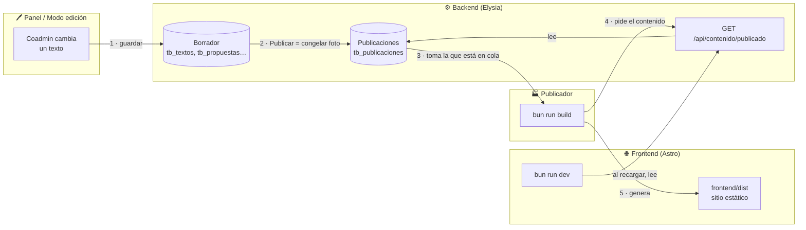
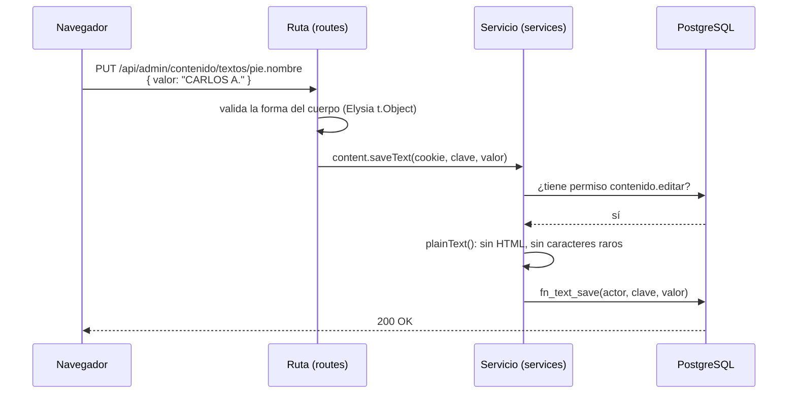
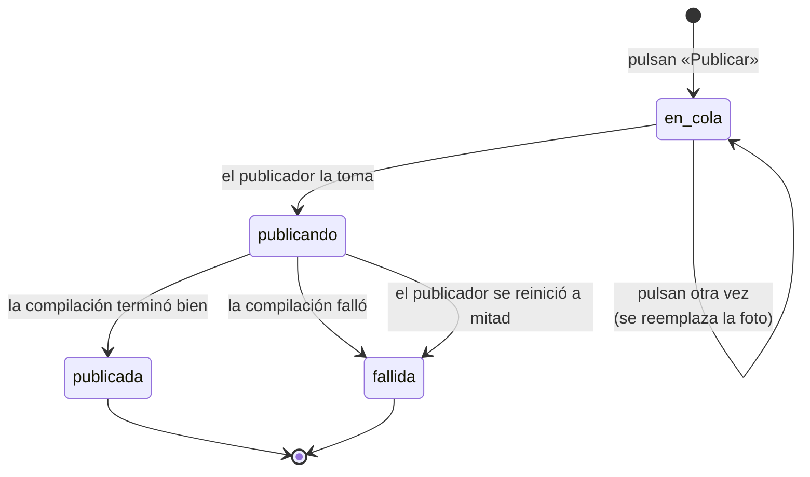
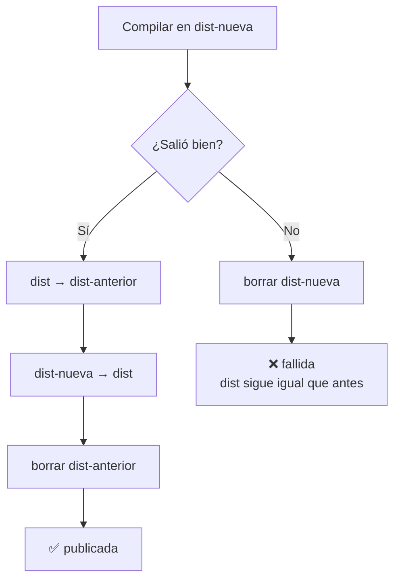
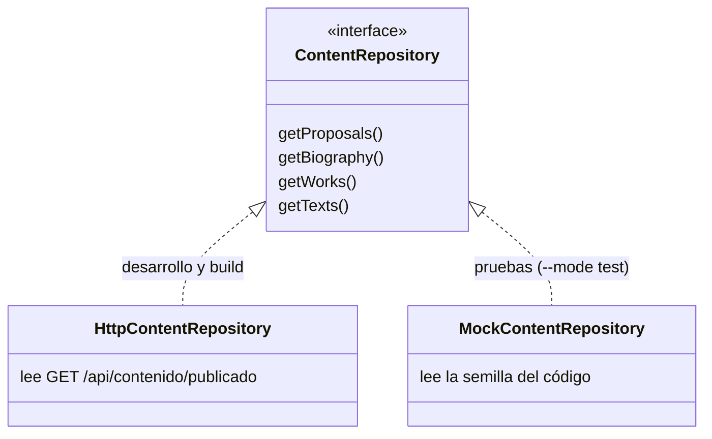
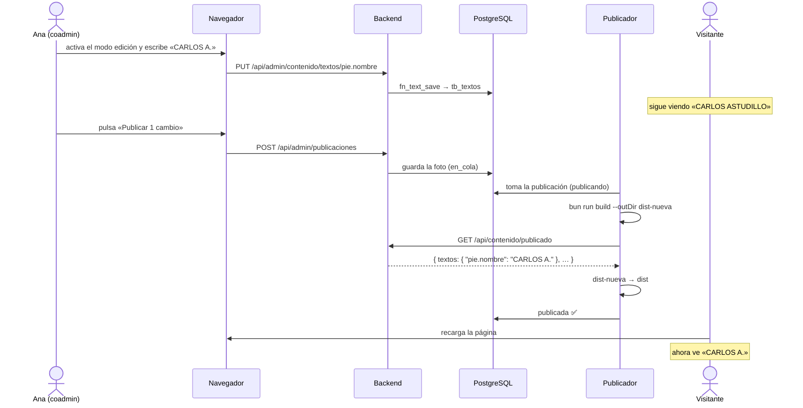
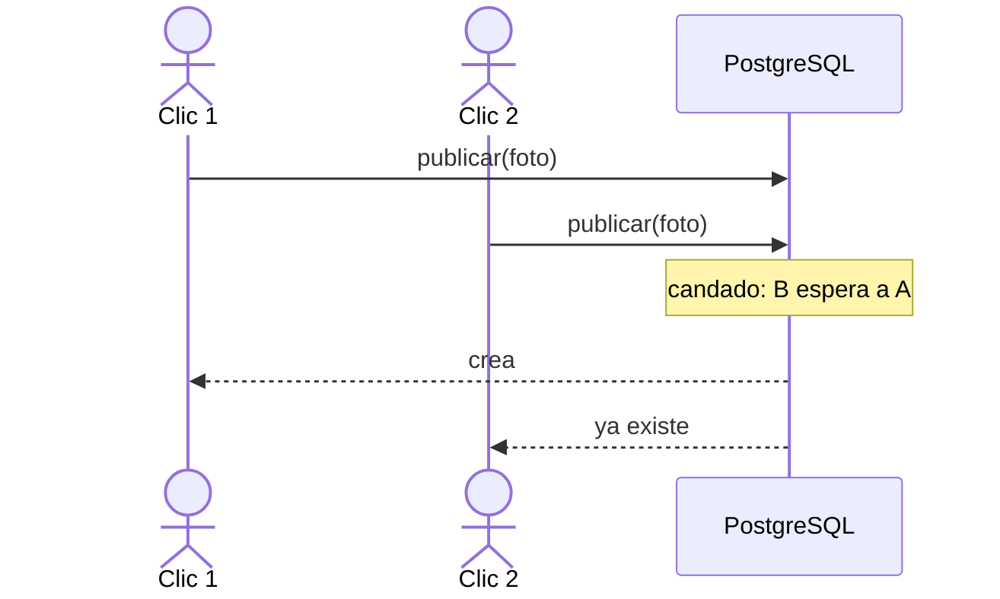
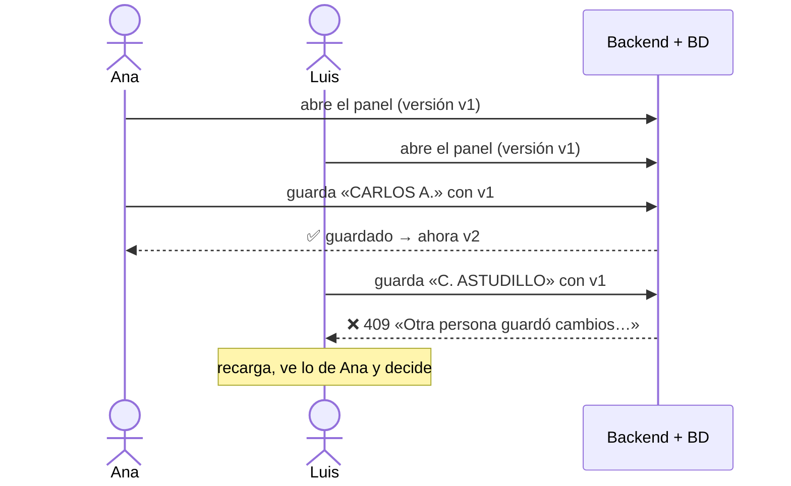

# Cómo funciona la edición con publicación

> Guía para entender, paso a paso, qué pasa desde que alguien cambia un texto en el panel hasta que el visitante lo ve en el sitio.
> Los ejemplos de código están **simplificados** para que se entiendan; al final de cada uno se indica el archivo real.

---

## 1. La idea en una frase

**Editar no cambia el sitio. Publicar sí.**

Todo lo que se toca en el panel se guarda como **borrador**. El sitio público solo cambia cuando alguien pulsa **«Publicar»**. En ese momento se toma una *foto* de todo el borrador y el sitio se reconstruye con ella.

### Una analogía: el periódico

| Periódico | Nuestro sitio |
| --- | --- |
| El redactor escribe y corrige en su computadora | El coadmin edita en el panel → **borrador** |
| Nadie en la calle ve esos cambios todavía | El sitio público no cambia |
| El editor dice «¡a imprenta!» | Alguien pulsa **«Publicar»** |
| Se imprime la edición del día (una copia fija) | Se congela una **foto del contenido** (snapshot) |
| La imprenta tarda un rato | El **publicador** compila el sitio (unos segundos) |
| Si la imprenta se daña, sigue circulando la edición de ayer | Si la compilación falla, sigue el sitio anterior |

---

## 2. El mapa completo



Hay **dos momentos** separados:

1. **Editar** (pasos 1): rápido, se puede hacer cien veces, nadie lo ve.
2. **Publicar** (pasos 2 a 5): una vez, cuando todo está listo.

---

## 3. Paso 1 — Editar: guardar en el borrador

### 3.1 Cómo sabe el sitio qué textos se pueden editar

Cada texto editable tiene una **clave** y un **valor por defecto** (el del diseño aprobado). Viven en un registro:

```ts
// frontend/src/lib/contenido/textos.ts (simplificado)
export const TEXTOS = {
  "pie.nombre": { texto: "CARLOS ASTUDILLO", max: 60 },
  "global.lema": { texto: "Por ti, San Lorenzo.", max: 60 },
  // …
};
```

En las páginas, en lugar de escribir el texto directo, se usa el componente `Editable`:

```astro
<!-- Antes -->
<span>CARLOS ASTUDILLO</span>

<!-- Ahora -->
<Editable clave="pie.nombre" />
```

`Editable` hace dos cosas:

```astro
---
// frontend/src/components/Editable.astro (simplificado)
const valor = await texto(clave);   // ① busca el valor publicado, o el de por defecto
---
<span data-editable={clave}>{valor}</span>  <!-- ② lo marca para el modo edición -->
```

Y `texto()` decide qué valor mostrar:

```ts
// frontend/src/lib/contenido.ts
export async function texto(clave) {
  const publicados = await contentRepository.getTexts(); // lo que llegó del backend
  return publicados[clave] ?? TEXTOS[clave].texto;       // si no lo cambiaron, el del diseño
}
```

> 💡 El operador `??` significa «si lo de la izquierda no existe, usa lo de la derecha». Así, un texto que nadie ha tocado sigue siendo exactamente el del diseño.

### 3.2 El modo edición en el navegador

Cuando entra alguien con permiso `contenido.editar`, el sitio descarga (solo para esa persona) el script del modo edición. Ese script busca todos los elementos con `data-editable` y los vuelve editables. Al terminar de escribir:

```ts
// frontend/src/scripts/modo-edicion.ts (simplificado)
async function save(el, nuevoTexto) {
  const clave = el.dataset.editable;          // "pie.nombre"
  await adminApi.saveText(clave, nuevoTexto); // PUT /api/admin/contenido/textos/pie.nombre
  notify("Guardado como borrador. Publica para que se vea en el sitio.");
}
```

### 3.3 El backend recibe el cambio



Las tres capas del backend, cada una con **una sola responsabilidad**:

```ts
// 1) RUTA: solo recibe y valida la forma — backend/src/content/routes/index.ts
.put('/contenido/textos/:clave', ({ cookie, params, body }) =>
  content.saveText(access(cookie), params.clave, body.valor), {
  body: t.Object({ valor: t.Union([t.String(), t.Null()]) }),
})

// 2) SERVICIO: permisos + reglas de negocio — backend/src/content/services/content.ts
async saveText(access, key, value) {
  const actor = await authorization.require(access, PERMISSIONS.contentEdit); // 401/403 si no
  const text = value === null ? null : plainText(value, 'Texto', 1000);       // 422 si trae HTML
  return callPg(sql, 'textSave', [actor.id_usuario, key, text]);
}
```

```sql
-- 3) BASE DE DATOS: guarda (y vuelve a comprobar el permiso) — backend/database/fn.sql
CREATE FUNCTION fn_text_save(p_actor integer, p_key text, p_value text) ... AS $$
BEGIN
  IF NOT fn_has_permission(p_actor, 'contenido.editar') THEN RETURN; END IF;
  IF p_value IS NULL THEN
    DELETE FROM tb_textos WHERE clave = p_key;            -- null = volver al texto del diseño
  ELSE
    INSERT INTO tb_textos (clave, valor) VALUES (p_key, p_value)
    ON CONFLICT (clave) DO UPDATE SET valor = EXCLUDED.valor; -- insertar o reemplazar
  END IF;
  INSERT INTO tb_auditoria (...) VALUES (...);             -- queda registro de quién lo hizo
END $$;
```

> 🔒 **¿Por qué el permiso se revisa dos veces?** Defensa en profundidad: si algún día alguien llama a la función SQL desde otro sitio olvidando la comprobación en TypeScript, la base de datos igual lo impide.

**Resultado del paso 1:** la tabla `tb_textos` tiene `pie.nombre = "CARLOS A."`. El sitio público **no cambió**.

Lo mismo ocurre con propuestas, biografía y obras, cada una con su tabla (`tb_propuestas`, `tb_biografia_hitos`, `tb_obras`…).

---

## 4. Paso 2 — Publicar: congelar una foto

### 4.1 Qué es el «snapshot»

Un **snapshot** es un único objeto JSON con **todo** el contenido editable del sitio en un instante:

```jsonc
{
  "version": 1,
  "textos":    { "pie.nombre": "CARLOS A." },
  "propuestas": [ { "slug": "agua-potable", "nombre": "Agua potable", "kpis": [ … ] }, … ],
  "biografia": [ { "anios": "19XX", "titulo": "Donde nacio", "texto": "…", "foto": null }, … ],
  "obras":     [ { "slug": "agua-potable", "hitos": [ … ], "fotos": [ … ] }, … ]
}
```

Su forma está definida en [`backend/src/content/types.ts`](../backend/src/content/types.ts) (`Snapshot`).

### 4.2 Qué pasa al pulsar «Publicar»

```ts
// backend/src/content/services/content.ts (simplificado)
async publish(access) {
  const actor = await authorization.require(access, PERMISSIONS.contentPublish);
  const actual = await snapshot();                         // lee TODO el borrador
  const ultima = await ultimaPublicada();
  if (ultima && diff(ultima, actual).length === 0)
    throw new ApiError(409, 'No hay cambios para publicar');
  return callPg(sql, 'publicationCreate', [actor.id_usuario, actual]); // guarda la foto
}
```

La foto se guarda en `tb_publicaciones` con estado **`en_cola`**. Si ya había una esperando en cola, se **reemplaza** (no tiene sentido compilar dos veces seguidas). Y si esa misma foto ya está en cola o compilándose, no se crea otra: se devuelve la existente (ver la sección 9).

### 4.3 ¿Cómo sabe el panel qué está pendiente?

Compara la última foto publicada con el borrador actual. Es una función pura, fácil de entender:

```ts
// backend/src/content/services/content.ts (simplificado)
function diff(antes, despues) {
  const cambios = [];
  for (const clave of todasLasClaves(antes.textos, despues.textos))
    if (antes.textos[clave] !== despues.textos[clave])
      cambios.push({ tipo: 'Texto', descripcion: clave });
  // … lo mismo para propuestas, biografía y obras
  return cambios;
}
```

Eso es lo que ves en la tarjeta **«Cambios pendientes»** y en el contador del botón **«Publicar 1 cambio»**.

---

## 5. Paso 3 — El publicador: la imprenta

El publicador es un proceso aparte (`bun run publicador`) que trabaja en bucle:

```ts
// backend/src/publisher/worker.ts (simplificado)
for (;;) {
  const trabajo = await tomarPublicacionEnCola(); // en_cola → publicando
  if (!trabajo) { await esperar(3000); continue; } // nada que hacer: revisa cada 3 s

  const ok = await ejecutar('bun run build --outDir dist-nueva');
  if (ok) {
    reemplazar('dist', 'dist-nueva');              // solo si todo salió bien
    await marcar(trabajo.id, 'publicada');
  } else {
    borrar('dist-nueva');                          // dist queda intacto
    await marcar(trabajo.id, 'fallida');
  }
}
```

### 5.1 La vida de una publicación



### 5.2 ¿Por qué compila en `dist-nueva` y no directo en `dist`?

Porque Astro **vacía** la carpeta de salida al empezar. Si compilara directo en `dist` y fallara a mitad, te quedarías sin sitio.



### 5.3 ¿Y si hubiera dos publicadores a la vez?

La función SQL que toma el trabajo usa `FOR UPDATE SKIP LOCKED`:

```sql
-- backend/database/fn.sql (fn_publication_claim)
UPDATE tb_publicaciones SET estado = 'publicando'
WHERE id_publicacion = (
  SELECT id_publicacion FROM tb_publicaciones
  WHERE estado = 'en_cola'
  LIMIT 1 FOR UPDATE SKIP LOCKED   -- «si otro ya la agarró, sáltala»
);
```

Es como una fila en el banco: si un cajero ya está atendiendo a alguien, el otro cajero no lo llama también.

---

## 6. Paso 4 — ¿De dónde saca el frontend el contenido?

Aquí está la pieza clave. El frontend **no** conoce la base de datos: le pregunta al backend por una ruta **pública** de solo lectura:

```
GET /api/contenido/publicado
```

```sql
-- backend/database/fn.sql
CREATE FUNCTION fn_publication_current() ... AS $$
  SELECT contenido FROM tb_publicaciones
  WHERE estado IN ('publicando', 'publicada')   -- nunca borradores, ni en cola, ni fallidas
  ORDER BY id_publicacion DESC LIMIT 1;
$$;
```

> ❓ **¿Por qué incluye `publicando`?** Porque mientras el publicador compila, el `build` necesita leer **justo** esa versión. Si falla, pasa a `fallida` y la ruta vuelve sola a la última `publicada`.

### 6.1 El repositorio HTTP

Las páginas nunca hacen `fetch` directo: piden los datos a un **repositorio** (regla del proyecto). Hay dos implementaciones con la misma interfaz:



```ts
// frontend/src/lib/data/index.ts
export const contentRepository = import.meta.env.MODE === "test"
  ? new MockContentRepository()  // pruebas: siempre los mismos datos
  : new HttpContentRepository(); // lo normal: lo publicado
```

Y el repositorio HTTP, en esencia:

```ts
// frontend/src/lib/data/http/http-content-repository.ts (simplificado)
async getTexts() {
  const respuesta = await fetch("http://127.0.0.1:3000/api/contenido/publicado");
  if (respuesta.status === 404) return {};   // nunca se publicó nada → textos del diseño
  const foto = await respuesta.json();
  return foto.textos;                         // { "pie.nombre": "CARLOS A." }
}
```

Detalles que conviene saber:

| Situación | Qué hace |
| --- | --- |
| `bun run build` | Pide el contenido **una sola vez** y lo reutiliza en las 24 páginas |
| `bun run dev` | Lo vuelve a pedir en cada recarga (caché de 1 s) → ves lo recién publicado |
| Nunca se publicó nada (404) | Usa la semilla del código |
| El backend está apagado | Error claro: *«el backend no responde en …»* (no muestra datos falsos sin avisar) |

---

## 7. Todo junto: un ejemplo de principio a fin

Cambiemos el nombre del pie de página de `CARLOS ASTUDILLO` a `CARLOS A.`:



Y así se ve cada tabla en cada momento:

| Momento | `tb_textos` (borrador) | `tb_publicaciones` | Lo que ve el visitante |
| --- | --- | --- | --- |
| Antes | *(vacía)* | #1 publicada `{textos:{}}` | CARLOS ASTUDILLO |
| Tras editar | `pie.nombre = CARLOS A.` | #1 publicada | CARLOS ASTUDILLO |
| Tras «Publicar» | `pie.nombre = CARLOS A.` | #1 publicada, **#2 en_cola** | CARLOS ASTUDILLO |
| Compilando | igual | #2 **publicando** | CARLOS ASTUDILLO |
| Terminado | igual | #2 **publicada** | **CARLOS A.** |

---

## 8. ¿Por qué hacerlo así y no guardar directo en el sitio?

| Ventaja | Explicación |
| --- | --- |
| **Sin sustos** | Se pueden hacer muchos cambios y revisarlos antes de que nadie los vea |
| **Cambios en bloque** | Se publican juntos: nunca queda la propuesta a medio actualizar |
| **Sitio rapidísimo** | El visitante recibe HTML ya hecho; no se consulta la base en cada visita |
| **Seguro ante fallos** | Si la compilación falla, sigue la versión anterior |
| **Historial** | Cada publicación queda registrada: quién, cuándo y si salió bien |
| **Menos superficie de ataque** | El sitio público es estático: no hay base de datos expuesta en cada página |

La contrapartida: el cambio tarda unos segundos en aparecer (lo que dura la compilación), en lugar de ser instantáneo.

---

## 9. Doble clic y dos personas a la vez

Dos problemas clásicos de cualquier sistema con varios usuarios:

1. **Doble clic** (o red lenta que reintenta): la misma orden llega dos veces.
2. **Edición concurrente**: dos personas cambian lo mismo; sin control, **gana la última** y el trabajo de la primera se pierde sin que nadie se entere.

### 9.1 Idempotencia: repetir no duplica

> Una operación es **idempotente** si hacerla una vez o diez veces deja el sistema igual.

Para «Publicar», la base de datos revisa, antes de crear nada, si **esa misma foto** ya está en cola o compilándose:

```sql
-- backend/database/fn.sql (fn_publication_create, simplificado)
PERFORM pg_advisory_xact_lock(hashtext('contenido:publicacion')); -- una a la vez
SELECT id_publicacion INTO v_id FROM tb_publicaciones
WHERE estado IN ('en_cola', 'publicando') AND contenido = p_content;
IF v_id IS NOT NULL THEN
  RETURN QUERY SELECT v_id, v_estado;  -- ya existe: se devuelve la misma
  RETURN;
END IF;
-- … si no, se crea
```

`pg_advisory_xact_lock` es un **candado** con nombre: si llegan cinco «Publicar» a la vez, PostgreSQL los pone en fila. El primero crea la publicación; los otros cuatro la encuentran y la devuelven. Hay una prueba que lo comprueba con cinco peticiones simultáneas.



### 9.2 Control optimista: «¿sigue igual que cuando lo abriste?»

Cada parte editable tiene una **versión**: una huella (md5) de su contenido actual. Al abrir el panel, llegan el contenido **y** sus versiones. Al guardar, se envía la versión que se tenía:

```ts
// frontend (simplificado)
const { textos, versiones } = await adminApi.draft();
await adminApi.saveText("pie.nombre", "CARLOS A.", versiones.textos["pie.nombre"]);
```

La base de datos compara, con el candado puesto:

```sql
-- backend/database/fn.sql (fn_text_save, simplificado)
v_actual := md5(valor actual);
IF v_actual = md5(p_value)   THEN RETURN 'sin_cambios'; END IF; -- repetir es seguro
IF v_actual <> p_version     THEN RETURN 'conflicto';   END IF; -- alguien guardó antes
-- … guarda y devuelve la versión nueva
```



Se llama **optimista** porque no bloquea a nadie mientras edita (sería incómodo): solo comprueba al guardar si alguien se adelantó. Lo mismo aplica a propuestas, obras, biografía y al rol o estado de una cuenta (ahí la «versión» es el rol o estado que se veía en la lista).

| Situación | Respuesta |
| --- | --- |
| Guardo con la versión vigente | 200, versión nueva |
| Repito exactamente lo mismo (doble clic) | 200, sin cambios |
| Otra persona guardó antes | 409, no se escribe nada |

---

## 10. Pruébalo tú mismo

Con tres terminales abiertas:

```bash
# Terminal 1 — backend
cd backend && bun run dev

# Terminal 2 — publicador
cd backend && bun run publicador

# Terminal 3 — frontend
cd frontend && bun run dev
```

1. Entra a `http://localhost:4321` con una cuenta coadmin o admin.
2. Activa el **modo edición** en la barra azul superior y cambia un texto del pie de página.
3. Abre otra ventana en modo incógnito (visitante sin sesión): el texto **no** cambió.
4. En el panel (`/cuenta/panel/#publicaciones`) pulsa **«Publicar»**. En la terminal 2 verás `Publicación N compilada…`.
5. Recarga la ventana de incógnito: ahora sí aparece el cambio.

Para ver la foto exacta que se publicó, abre en el navegador:
`http://127.0.0.1:3000/api/contenido/publicado`

---

## 11. Mapa de archivos

| Qué | Dónde |
| --- | --- |
| Registro de textos editables | [`frontend/src/lib/contenido/textos.ts`](../frontend/src/lib/contenido/textos.ts) |
| Componente `Editable` | [`frontend/src/components/Editable.astro`](../frontend/src/components/Editable.astro) |
| Modo edición (navegador) | [`frontend/src/scripts/modo-edicion.ts`](../frontend/src/scripts/modo-edicion.ts) |
| Panel de administración | [`frontend/src/scripts/panel/`](../frontend/src/scripts/panel/) |
| Repositorio que lee lo publicado | [`frontend/src/lib/data/http/http-content-repository.ts`](../frontend/src/lib/data/http/http-content-repository.ts) |
| Rutas del contenido | [`backend/src/content/routes/index.ts`](../backend/src/content/routes/index.ts) |
| Lógica: guardar, publicar, diferencias | [`backend/src/content/services/content.ts`](../backend/src/content/services/content.ts) |
| Forma del snapshot | [`backend/src/content/types.ts`](../backend/src/content/types.ts) |
| Funciones SQL | [`backend/database/fn.sql`](../backend/database/fn.sql) |
| Publicador | [`backend/src/publisher/worker.ts`](../backend/src/publisher/worker.ts) |

---

## Glosario

- **Borrador**: el contenido en las tablas de edición; solo lo ven quienes editan.
- **Snapshot (foto)**: copia congelada de todo el borrador en el momento de publicar.
- **Publicador**: proceso que toma la foto en cola y reconstruye el sitio.
- **Sitio estático**: páginas HTML generadas de antemano (`dist`), sin consultar la base en cada visita.
- **Repositorio**: capa que entrega datos a las páginas y oculta de dónde vienen (API o semilla).
- **Semilla**: datos de ejemplo escritos en el código; se usan en las pruebas y antes de la primera publicación.
