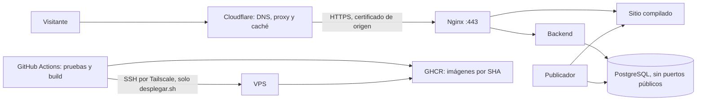

# Guía de despliegue: Hostinger, Docker Compose, Cloudflare y GitHub Actions

Actualizada el 4 de octubre de 2026. **Ruta elegida: Docker Compose directo en el VPS + GitHub Actions como interfaz de CI/CD.** Se descartó Dokploy: en un KVM 1 (1 núcleo, 4 GB) su panel, su PostgreSQL, Redis y Traefik consumen recursos permanentes, obligan a adaptar Nginx y los certificados, y añaden otro panel con poder de root. La recuperación ante caídas la da Docker (`restart: unless-stopped`) y la interfaz de despliegue, la pestaña *Actions* de GitHub.

Estado al 4 de octubre: fases 1 a 8 terminadas; el sitio está desplegado en https://lanuevahistoria.tech desde GitHub Actions (versión `520bc27`). Falta crear la cuenta administradora y las fases 9 y 10. Cada fase termina con una **comprobación**: no pasar a la siguiente sin cumplirla. Marcar las casillas a medida que se avanza.

| Dato | Valor |
| --- | --- |
| VPS | Hostinger KVM 1, Ubuntu 24.04 LTS, 1 núcleo, 4 GB RAM, 50 GB disco, Boston |
| IPv4 | `179.236.237.229` |
| Dominio | `lanuevahistoria.tech`, registrado en Hostinger |
| Repositorio | `exinoss/web-astudillo`, rama `main` |



## Resumen de fases

| Fase | Quién | Resultado | Estado |
| --- | --- | --- | --- |
| 1. Cloudflare y DNS | Usuario | Dominio activo en Cloudflare | ✅ |
| 2. Acceso seguro a Ubuntu | Usuario | Cuenta propia con clave, sin contraseña ni root por SSH | ✅ |
| 3. Tailscale y cortafuegos | Usuario | SSH fuera de Internet; 80/443 solo desde Cloudflare | ✅ |
| 4. Docker | Usuario | Docker y Compose instalados | ✅ |
| 5. Certificado de origen | Usuario | HTTPS Full (strict) listo | ✅ |
| 6. Ajustes del repositorio | Agente + revisión del usuario | Compose con imágenes de GHCR, usuarios de PostgreSQL, migración, reconstrucción del sitio, workflow | ✅ |
| 7. Preparar el VPS para desplegar | Usuario | Cuenta `despliegue`, repositorio, `.env`, certificado y clave de CI | ✅ |
| 8. Conectar GitHub y primer despliegue | Usuario | Push a `main` → pruebas → despliegue; admin creado | ✅ (admin pendiente) |
| 9. Respaldos y avisos | Usuario | Copias externas restauradas al menos una vez |  |
| 10. Abrir al público | Equipo | Lista final comprobada |  |

---

## Fase 1. Agregar el dominio a Cloudflare

- [ ] En Cloudflare: *Add a domain* → `lanuevahistoria.tech` → plan Free.
- [ ] Revisar los registros detectados. Conservar los de correo y verificación en uso (MX, TXT, SPF, DKIM, DMARC) y borrar registros A/AAAA que apunten a otro alojamiento.
- [ ] Dejar estos registros web:

  | Tipo | Nombre | Destino | Proxy |
  | --- | --- | --- | --- |
  | A | `@` | `179.236.237.229` | Activado (nube naranja) |
  | CNAME | `www` | `lanuevahistoria.tech` | Activado (nube naranja) |

- [ ] No añadir AAAA sin haber configurado antes la IPv6 real del VPS.
- [ ] En Hostinger: Dominios → `lanuevahistoria.tech` → DNS/Nameservers → cambiar por los **dos nameservers que muestra Cloudflare** (copiarlos exactamente).
- [ ] Si había DNSSEC activo en Hostinger, desactivarlo antes del cambio. Cuando Cloudflare marque la zona como activa, habilitar DNSSEC en Cloudflare y registrar el DS en Hostinger.

**Comprobación** (PowerShell): `Resolve-DnsName lanuevahistoria.tech -Type NS` devuelve los nameservers de Cloudflare, y Cloudflare muestra la zona como *Active*. Que el sitio dé error todavía es normal.

## Fase 2. Acceso seguro a Ubuntu

Mantener abierta una sesión de root durante toda esta fase y probar cada cambio desde **otra** terminal. Si algo falla, queda la consola web de Hostinger.

1. En el PC, crear una clave si no existe:

   ```powershell
   ssh-keygen -t ed25519 -C "juan-pc"
   ```

2. Entrar como root y actualizar:

   ```bash
   ssh root@179.236.237.229
   apt update && apt full-upgrade -y
   ```

3. Crear la cuenta administrativa (sustituir `<usuario>`):

   ```bash
   adduser <usuario>
   usermod -aG sudo <usuario>
   install -d -m 700 -o <usuario> -g <usuario> /home/<usuario>/.ssh
   ```

4. Desde el PC, copiar la clave pública:

   ```powershell
   Get-Content $env:USERPROFILE\.ssh\id_ed25519.pub | ssh root@179.236.237.229 "cat >> /home/<usuario>/.ssh/authorized_keys && chown <usuario>: /home/<usuario>/.ssh/authorized_keys && chmod 600 /home/<usuario>/.ssh/authorized_keys"
   ```

5. En **otra terminal**, comprobar `ssh <usuario>@179.236.237.229` y `sudo -v`.
6. Con eso comprobado, cerrar la contraseña y root. El archivo empieza por `10-` para que tenga prioridad sobre el `50-cloud-init.conf` de Hostinger (sshd usa el primer valor que encuentra):

   ```bash
   sudo tee /etc/ssh/sshd_config.d/10-endurecido.conf >/dev/null <<'EOF'
   PasswordAuthentication no
   KbdInteractiveAuthentication no
   PermitRootLogin no
   EOF
   sudo sshd -t && sudo systemctl reload ssh
   ```

7. Actualizaciones de seguridad automáticas y swap de 2 GB como margen ante picos del publicador:

   ```bash
   sudo apt install -y unattended-upgrades
   sudo dpkg-reconfigure -plow unattended-upgrades
   sudo fallocate -l 2G /swapfile && sudo chmod 600 /swapfile
   sudo mkswap /swapfile && sudo swapon /swapfile
   echo '/swapfile none swap sw 0 0' | sudo tee -a /etc/fstab
   ```

**Comprobación:** desde una terminal nueva, `ssh root@179.236.237.229` es rechazado; `ssh <usuario>@179.236.237.229` entra sin pedir contraseña del servidor; `sudo sshd -T | grep -E 'passwordauth|permitroot'` muestra `no`; `free -h` muestra 2 GB de swap.

## Fase 3. Tailscale y cortafuegos

El SSH deja de estar expuesto a Internet: se entra por una red privada de Tailscale (gratuita), tanto desde el PC como desde GitHub Actions. Así no hace falta abrir el puerto 22 a las IP cambiantes de GitHub.

1. Crear una cuenta en Tailscale e instalar la app en el PC.
2. En el VPS:

   ```bash
   curl -fsSL https://tailscale.com/install.sh | sh
   sudo tailscale up
   ```

   Abrir el enlace que muestra y autorizar el equipo. En la consola de Tailscale, desactivar *Key expiry* para el VPS.
3. Desde el PC: `ssh <usuario>@<nombre-del-vps-en-tailscale>` (el nombre aparece en la consola, por ejemplo `vps-astudillo`).
4. Con el acceso por Tailscale comprobado, configurar el **cortafuegos de Hostinger** (VPS → Seguridad → Cortafuegos). Al activarlo, descarta todo lo que no esté permitido:

   | Entrada | Regla |
   | --- | --- |
   | TCP 80 y 443 | Permitir solo los rangos de <https://www.cloudflare.com/ips-v4/> (y los de IPv6 si se activa) |
   | TCP 22 | Ninguna regla (cerrado a Internet) |
   | Todo lo demás | Sin reglas |

5. Guardar en algún lugar seguro que, si Tailscale falla, se entra por la **consola web de Hostinger** o añadiendo temporalmente una regla de 22 para la IP propia.

Docker puede saltarse UFW en los puertos que publica; por eso el filtro bueno es el de Hostinger, que está fuera del VPS. Mantener los rangos de Cloudflare iguales en el cortafuegos y en `server-produccion/nginx/cloudflare.conf`.

**Comprobación:** con Tailscale **desconectado** en el PC, `Test-NetConnection 179.236.237.229 -Port 22` falla. Con Tailscale conectado, el SSH entra.

## Fase 4. Instalar Docker

Desde el repositorio oficial ([documentación](https://docs.docker.com/engine/install/ubuntu/)), no desde las plantillas de Hostinger:

```bash
sudo install -m 0755 -d /etc/apt/keyrings
sudo curl -fsSL https://download.docker.com/linux/ubuntu/gpg -o /etc/apt/keyrings/docker.asc
sudo chmod a+r /etc/apt/keyrings/docker.asc
echo "deb [arch=$(dpkg --print-architecture) signed-by=/etc/apt/keyrings/docker.asc] https://download.docker.com/linux/ubuntu $(. /etc/os-release && echo "$VERSION_CODENAME") stable" | sudo tee /etc/apt/sources.list.d/docker.list >/dev/null
sudo apt update
sudo apt install -y docker-ce docker-ce-cli containerd.io docker-buildx-plugin docker-compose-plugin
```

No añadir la cuenta personal al grupo `docker` (equivale a root): usar `sudo docker …`. La única cuenta en ese grupo será `despliegue`, en la fase 7.

**Comprobación:** `sudo docker run --rm hello-world` y `docker compose version` funcionan.

## Fase 5. Certificado de origen y SSL en Cloudflare

1. Cloudflare → SSL/TLS → Origin Server → *Create certificate*, para `lanuevahistoria.tech` y `*.lanuevahistoria.tech`. Guardar el certificado y la clave **solo** en el PC hasta la fase 7 (la clave no vuelve a mostrarse). Anotar la fecha de vencimiento en el calendario del equipo.
2. SSL/TLS → modo **Full (strict)**. Nunca Flexible.
3. SSL/TLS → Edge Certificates: activar *Always Use HTTPS*. HSTS se activa después de comprobar HTTPS en la fase 10, sin preload.
4. Reglas de redirección: `www.lanuevahistoria.tech/*` → `https://lanuevahistoria.tech/$1` (301, conservando la ruta).
5. Caché: no crear reglas «Cache Everything». Nginx ya marca la API como `no-store` y los recursos de `/_astro/` como inmutables.
6. Dejar Rocket Loader y la minificación de scripts desactivados.

**Comprobación:** la zona muestra el certificado de borde activo y el modo Full (strict).

## Fase 6. Ajustes del repositorio

Hechos el 4 de octubre de 2026 y comprobados en local: `bun run check` y las 72 pruebas del backend (incluidas las de permisos), `astro check`, `bun run build` y los 79 tests de Playwright. Lo que depende de Docker (`roles.sh`, `compose.yml` y Nginx) se comprueba en el primer despliegue de la fase 8.

| Ajuste | Dónde |
| --- | --- |
| Imágenes por versión: `ghcr.io/exinoss/astudillo-backend:<SHA>` y `…-publicador:<SHA>`; el VPS no compila | `server-produccion/compose.yml` |
| Servicio `migrar` con la imagen nueva y el usuario dueño del esquema | `compose.yml` |
| Semilla dentro de la imagen del backend | `backend/Dockerfile` |
| Usuarios de PostgreSQL separados, cada uno con su clave y sus permisos mínimos, más pruebas de acceso permitido y denegado | `server-produccion/postgres/roles.sh`, `backend/database/permisos.sql`, `backend/tests/permisos.test.ts` |
| Variables por servicio: el publicador ya no recibe JWT ni SMTP | `compose.yml` |
| Con cada versión nueva, el publicador recompila lo último publicado (sin borradores, sin crear publicaciones) y escribe la versión en el volumen | `backend/src/publisher/worker.ts` |
| Fotos fuera del contexto de construcción | `backend/.dockerignore` |
| Nginx 1.30 (rama estable) y cabeceras de seguridad | `compose.yml`, `nginx/cabeceras.conf` |
| Playwright con Chromium en CI y Edge en local | `frontend/playwright.config.ts` |
| Script de despliegue | `server-produccion/desplegar.sh` |
| Workflow: pruebas → imágenes → despliegue, y vuelta atrás | `.github/workflows/despliegue.yml` |

Queda para después de publicar: la CSP (hay que probarla con Google, el visor 3D y Lottie en el servidor real) y HSTS en Cloudflare (fase 10).

**Los commits los haces tú.** Revisa los cambios y súbelos a `main` antes de la fase 7, que clona el repositorio en el VPS. Ese primer push ejecuta las pruebas y construye las imágenes en GHCR; el paso «desplegar» fallará porque todavía no hay secretos configurados. Es lo esperado.

## Fase 7. Preparar el VPS para desplegar

Todo en el VPS como `astudillo` (`ssh astudillo@vps-astudillo`), salvo donde dice «en el PC».

1. **Cuenta de despliegue** (sin contraseña; es la única en el grupo `docker`):

   ```bash
   sudo adduser --disabled-password --gecos "" despliegue
   sudo usermod -aG docker despliegue
   sudo install -d -o despliegue -g despliegue -m 750 /opt/astudillo
   sudo -u despliegue git clone https://github.com/exinoss/web-astudillo.git /opt/astudillo/repo
   ```

   `/opt/astudillo` solo lo abre `despliegue`: `astudillo` recibe `Permission denied` sin `sudo`, y es lo correcto.

2. **Secretos.** Se trabaja como `despliegue` (`sudo -iu despliegue`; `exit` para volver). Las claves se generan en el servidor y no se muestran en pantalla:

   ```bash
   sudo -iu despliegue
   cd /opt/astudillo/repo/server-produccion
   cp .env.example .env
   chmod 600 .env
   for v in POSTGRES_PASSWORD DB_MIGRA_PASSWORD DB_APP_PASSWORD DB_PUB_PASSWORD JWT_SECRET; do
     sed -i "s/^$v=.*/$v=$(openssl rand -hex 32)/" .env
   done
   nano .env
   ```

   En `nano` completa `GOOGLE_CLIENT_ID` y los `SMTP_*`. Si todavía no hay proveedor de correo, pon valores provisionales (por ejemplo `SMTP_HOST=smtp.invalid`): el sitio arranca, pero los correos de verificación no saldrán hasta la fase 10.

   Comprueba que no quedó ninguna variable vacía (no muestra los valores):

   ```bash
   grep -E '^[A-Z_]+=
   ```

3. **Certificado de origen.** En PowerShell del PC:

   ```powershell
   scp "$env:USERPROFILE\Documents\DOCUMENTSTEXT\astudillo-certificados\origin.pem" astudillo@vps-astudillo:origen.pem
   scp "$env:USERPROFILE\Documents\DOCUMENTSTEXT\astudillo-certificados\origin.key" astudillo@vps-astudillo:origen.key
   ```

   En el VPS:

   ```bash
   C=/opt/astudillo/repo/server-produccion/certificados
   sudo install -d -o despliegue -g despliegue -m 700 $C
   sudo install -o despliegue -g despliegue -m 644 ~/origen.pem $C/origen.pem
   sudo install -o despliegue -g despliegue -m 600 ~/origen.key $C/origen.key
   rm ~/origen.pem ~/origen.key
   ```

4. **Clave de GitHub Actions.** En PowerShell del PC, sin frase (la usará un robot):

   ```powershell
   ssh-keygen -t ed25519 -N '""' -C github-actions -f "$env:USERPROFILE\Documents\DOCUMENTSTEXT\astudillo-certificados\ci_despliegue"
   Get-Content "$env:USERPROFILE\Documents\DOCUMENTSTEXT\astudillo-certificados\ci_despliegue.pub"
   ```

   En el VPS, sustituyendo `ssh-ed25519 AAAA…` por la línea que mostró el comando anterior. `command=` hace que esa clave **solo** pueda ejecutar `desplegar.sh`:

   ```bash
   sudo install -d -o despliegue -g despliegue -m 700 /home/despliegue/.ssh
   echo 'command="bash /opt/astudillo/repo/server-produccion/desplegar.sh",restrict ssh-ed25519 AAAA… github-actions' \
     | sudo -u despliegue tee /home/despliegue/.ssh/authorized_keys >/dev/null
   sudo chmod 600 /home/despliegue/.ssh/authorized_keys
   ```

**Comprobación:** en PowerShell del PC,

```powershell
ssh -i "$env:USERPROFILE\Documents\DOCUMENTSTEXT\astudillo-certificados\ci_despliegue" despliegue@vps-astudillo prueba
```

debe responder `ERROR: Uso: desplegar.sh <sha de 40 caracteres>`, y `ssh -i … despliegue@vps-astudillo bash` debe dar el mismo error y no abrir una consola.

## Fase 8. Conectar GitHub y primer despliegue

### Cómo funciona

1. **Push a `main`** (o *Run workflow*): Actions comprueba tipos, ejecuta las pruebas del backend con una PostgreSQL desechable y las de Playwright.
2. Construye las imágenes de backend y publicador y las sube a GHCR con el SHA del commit.
3. Entra en Tailscale con una identidad temporal (`tag:ci`) y ejecuta `ssh despliegue@vps-astudillo <SHA>`.
4. En el VPS, `desplegar.sh`:
   1. impide dos despliegues a la vez y comprueba que queden 3 GB libres;
   2. pone el repositorio en ese SHA (configuración de Nginx y compose de la misma versión) y descarga las imágenes;
   3. si la base ya existe, guarda un respaldo (`/opt/astudillo/respaldos/`, los 5 últimos);
   4. detiene el publicador, aplica las migraciones con la imagen nueva y arranca todo; si la migración falla, se detiene ahí;
   5. espera a que el backend esté sano y a que el publicador haya recompilado el sitio con esa versión;
   6. anota el SHA en `/opt/astudillo/versiones`.
5. Actions comprueba `https://lanuevahistoria.tech/api/health` desde fuera.

La primera vez, la misma ejecución crea la base: `roles.sh` crea los usuarios con las claves del `.env`, la migración crea las tablas y la semilla, y el publicador compila el sitio inicial.

### Configuración

1. **Tailscale → Access controls → JSON editor.** El VPS lleva la etiqueta `tag:servidor` (Machines → ⋯ → *Edit ACL tags*), así no puede iniciar conexiones hacia los equipos personales. La política aplicada:

   ```jsonc
   {
     "tagOwners": { "tag:servidor": ["autogroup:admin"], "tag:ci": ["autogroup:admin"] },
     "grants": [
       {"src": ["autogroup:member"], "dst": ["*"], "ip": ["*"]},
       {"src": ["tag:ci"], "dst": ["tag:servidor"], "ip": ["tcp:22"]},
     ],
     "tests": [
       {"src": "tag:ci", "accept": ["tag:servidor:22"], "deny": ["tag:servidor:443", "tag:servidor:5432", "100.110.124.52:22"]},
       {"src": "tag:servidor", "deny": ["100.110.124.52:22", "100.110.124.52:3389"]},
     ],
   }
   ```

   Más la sección `"ssh"` que trae Tailscale por defecto.

2. **Tailscale → Settings → OAuth clients → Generate**: permiso *Auth Keys* de escritura con la etiqueta `tag:ci`. Guarda el *Client ID* y el *Client secret* (el secreto solo se muestra una vez).
3. **SSH_KNOWN_HOSTS.** En PowerShell del PC, con Tailscale conectado: `ssh-keyscan vps-astudillo`. Copia todas las líneas que empiezan por `vps-astudillo`.
4. **GitHub → repositorio → Settings → Environments → New environment** `production`:
   - *Deployment branches and tags*: **Selected branches** → `main`.
   - *Environment secrets*:

     | Nombre | Valor |
     | --- | --- |
     | `TS_OAUTH_CLIENT_ID` | Client ID de Tailscale |
     | `TS_OAUTH_SECRET` | Client secret de Tailscale |
     | `SSH_CLAVE_DESPLIEGUE` | Contenido completo de `ci_despliegue` (la clave **privada**, sin `.pub`) |
     | `SSH_KNOWN_HOSTS` | Las líneas del paso 3 |

   Después, borra `ci_despliegue` del PC (la `.pub` puede quedarse).

### Primer despliegue

1. Comprueba en *Actions* que la ejecución del push de la fase 6 pasó las pruebas y el job `imagenes`.
2. GHCR crea los paquetes como privados y el VPS no podría descargarlos. GitHub → tu perfil → *Packages* → `astudillo-backend` → *Package settings* → *Change visibility* → **Public**. Lo mismo con `astudillo-publicador`. El código ya es público, así que las imágenes no exponen nada nuevo; no contienen `.env` ni certificados.
3. En esa ejecución, **Re-run failed jobs** (o *Run workflow* en `main`). El primer despliegue puede tardar varios minutos: compila el sitio en el VPS.
4. Crea la cuenta administradora:

   ```bash
   sudo -iu despliegue
   cd /opt/astudillo/repo/server-produccion
   docker compose exec backend bun run admin:crear
   exit
   ```

**Comprobación:**
- `https://lanuevahistoria.tech/api/health` responde `{"ok":true}` y la portada carga.
- Iniciar sesión con el admin funciona.
- `cat /opt/astudillo/versiones` muestra el SHA.
- En el VPS, `sudo ss -lntp | grep -E ':(5432|3000)'` no muestra nada.
- Un commit pequeño posterior se despliega solo y termina en verde.

### Volver a una versión anterior

*Actions* → *Pruebas y despliegue* → *Run workflow* → escribir el SHA anterior (está en `/opt/astudillo/versiones` y en el historial de *Actions*). No se prueba ni se construye nada: sus imágenes ya están en GHCR. Solo funciona si esa versión es compatible con la base ya migrada; nunca se revierte la base de forma automática.

### Publicación desde el panel

Es independiente del despliegue de código: «Publicar» encola una compilación que hace el publicador en el VPS, sin pasar por GitHub. Si coincide con un despliegue, esa publicación queda como fallida y basta con volver a publicar. Medir cuánto tarda y cuánta memoria usa en el KVM 1.

## Fase 9. Respaldos y avisos

Antes de recibir datos reales:

1. **Destino externo:** un bucket privado (por ejemplo Cloudflare R2 o Backblaze B2) con una credencial que solo pueda escribir en él.
2. **Script diario** (cron del usuario `despliegue`): `pg_dump` + copia de los volúmenes `astudillo_medios` y `astudillo_privados`, cifrado con `age` o `rclone crypt`, subido con `rclone`. Conservar 7 diarias y 4 semanales. La clave para descifrar se guarda fuera del VPS.
3. Para que la base y las fotos coincidan, hacer el respaldo con el publicador detenido y en un horario sin actividad, o aceptar y documentar la diferencia de segundos entre ambas copias.
4. **Ensayo de restauración** en el PC con `server-local/`: comprobar cuentas, publicaciones y fotos privadas. Anotar fecha y resultado.
5. **Monitor externo** gratuito (UptimeRobot o Better Stack) sobre la portada y `/api/health`, avisando por correo o Telegram. Añadir un aviso si el respaldo no se sube en 26 horas (por ejemplo, un *heartbeat* del mismo servicio).

Los backups semanales de Hostinger son una capa adicional, no sustituyen la copia externa.

**Comprobación:** existe un respaldo cifrado en el bucket, se restauró una vez y apagar el backend durante unos minutos genera un aviso.

## Fase 10. Google, correo y apertura al público

1. Google Auth Platform: añadir `https://lanuevahistoria.tech` como origen autorizado del cliente web; el mismo client ID en backend y frontend.
2. SMTP saliente de un proveedor (no instalar servidor de correo en el VPS), con SPF, DKIM y DMARC en Cloudflare. Probar verificación de cuenta y restablecimiento de contraseña, también la llegada a spam.
3. Completar en privacidad los proveedores reales: Hostinger (EE. UU.), Cloudflare, Google, SMTP, Tailscale y destino de respaldos.
4. Publicar el contenido definitivo desde el panel y sustituir el WhatsApp de prueba.

Lista final antes de anunciar el sitio:

- [ ] DNS activo, Full (strict), redirecciones `http` → `https` y `www` → raíz sin bucles.
- [ ] IP directa y puertos 22, 3000 y 5432 sin respuesta desde Internet.
- [ ] La IP real del visitante llega al backend (probar el límite de intentos de acceso).
- [ ] Cabeceras de seguridad en páginas, API y errores; ninguna respuesta de cuenta o alerta en caché.
- [ ] Registro con correo y Google, aceptación de términos, recuperación de acceso y roles.
- [ ] Fotos privadas de alertas solo visibles para su autor y quien revisa; reintentos y conflictos (409).
- [ ] Editar → guardar → publicar actualiza el sitio; un despliegue de código también reconstruye el contenido aprobado.
- [ ] 404 real, sitemap, robots, canonical, JSON-LD e imagen al compartir con el dominio definitivo.
- [ ] Móvil desde 320 px, orientación, teclado, los ocho modos de accesibilidad y el visor 3D en el servidor real.
- [ ] Carga medida en móvil y consumo durante una publicación.
- [ ] Respaldo restaurado y aviso de caída recibido.
- [ ] HSTS activado (sin preload) tras comprobar todo lo anterior.

Después: Search Console y envío del sitemap. Marcar los pendientes del [plan previo](plan-previo-publicacion.md) solo con evidencia real.
 .env || echo "TODO COMPLETO"
   exit
   ```

3. **Certificado de origen.** En PowerShell del PC:

   ```powershell
   scp "$env:USERPROFILE\Documents\DOCUMENTSTEXT\astudillo-certificados\origin.pem" astudillo@vps-astudillo:origen.pem
   scp "$env:USERPROFILE\Documents\DOCUMENTSTEXT\astudillo-certificados\origin.key" astudillo@vps-astudillo:origen.key
   ```

   En el VPS:

   ```bash
   C=/opt/astudillo/repo/server-produccion/certificados
   sudo install -d -o despliegue -g despliegue -m 700 $C
   sudo install -o despliegue -g despliegue -m 644 ~/origen.pem $C/origen.pem
   sudo install -o despliegue -g despliegue -m 600 ~/origen.key $C/origen.key
   rm ~/origen.pem ~/origen.key
   ```

4. **Clave de GitHub Actions.** En PowerShell del PC, sin frase (la usará un robot):

   ```powershell
   ssh-keygen -t ed25519 -N '""' -C github-actions -f "$env:USERPROFILE\Documents\DOCUMENTSTEXT\astudillo-certificados\ci_despliegue"
   Get-Content "$env:USERPROFILE\Documents\DOCUMENTSTEXT\astudillo-certificados\ci_despliegue.pub"
   ```

   En el VPS, sustituyendo `ssh-ed25519 AAAA…` por la línea que mostró el comando anterior. `command=` hace que esa clave **solo** pueda ejecutar `desplegar.sh`:

   ```bash
   sudo install -d -o despliegue -g despliegue -m 700 /home/despliegue/.ssh
   echo 'command="bash /opt/astudillo/repo/server-produccion/desplegar.sh",restrict ssh-ed25519 AAAA… github-actions' \
     | sudo -u despliegue tee /home/despliegue/.ssh/authorized_keys >/dev/null
   sudo chmod 600 /home/despliegue/.ssh/authorized_keys
   ```

**Comprobación:** en PowerShell del PC,

```powershell
ssh -i "$env:USERPROFILE\Documents\DOCUMENTSTEXT\astudillo-certificados\ci_despliegue" despliegue@vps-astudillo prueba
```

debe responder `ERROR: Uso: desplegar.sh <sha de 40 caracteres>`, y `ssh -i … despliegue@vps-astudillo bash` debe dar el mismo error y no abrir una consola.

## Fase 8. Conectar GitHub y primer despliegue

### Cómo funciona

1. **Push a `main`** (o *Run workflow*): Actions comprueba tipos, ejecuta las pruebas del backend con una PostgreSQL desechable y las de Playwright.
2. Construye las imágenes de backend y publicador y las sube a GHCR con el SHA del commit.
3. Entra en Tailscale con una identidad temporal (`tag:ci`) y ejecuta `ssh despliegue@vps-astudillo <SHA>`.
4. En el VPS, `desplegar.sh`:
   1. impide dos despliegues a la vez y comprueba que queden 3 GB libres;
   2. pone el repositorio en ese SHA (configuración de Nginx y compose de la misma versión) y descarga las imágenes;
   3. si la base ya existe, guarda un respaldo (`/opt/astudillo/respaldos/`, los 5 últimos);
   4. detiene el publicador, aplica las migraciones con la imagen nueva y arranca todo; si la migración falla, se detiene ahí;
   5. espera a que el backend esté sano y a que el publicador haya recompilado el sitio con esa versión;
   6. anota el SHA en `/opt/astudillo/versiones`.
5. Actions comprueba `https://lanuevahistoria.tech/api/health` desde fuera.

La primera vez, la misma ejecución crea la base: `roles.sh` crea los usuarios con las claves del `.env`, la migración crea las tablas y la semilla, y el publicador compila el sitio inicial.

### Configuración

1. **Tailscale → Access controls.** Envíame una captura antes de guardar: hay que añadir la etiqueta `tag:ci` y limitarla al puerto 22 del VPS. La política queda así:

   ```json
   {
     "tagOwners": { "tag:ci": ["autogroup:admin"] },
     "hosts": { "vps-astudillo": "100.125.180.73" },
     "grants": [
       { "src": ["autogroup:member"], "dst": ["*"], "ip": ["*"] },
       { "src": ["tag:ci"], "dst": ["vps-astudillo"], "ip": ["tcp:22"] }
     ]
   }
   ```

2. **Tailscale → Settings → OAuth clients → Generate**: permiso *Auth Keys* de escritura con la etiqueta `tag:ci`. Guarda el *Client ID* y el *Client secret* (el secreto solo se muestra una vez).
3. **SSH_KNOWN_HOSTS.** En PowerShell del PC, con Tailscale conectado: `ssh-keyscan vps-astudillo`. Copia todas las líneas que empiezan por `vps-astudillo`.
4. **GitHub → repositorio → Settings → Environments → New environment** `production`:
   - *Deployment branches and tags*: **Selected branches** → `main`.
   - *Environment secrets*:

     | Nombre | Valor |
     | --- | --- |
     | `TS_OAUTH_CLIENT_ID` | Client ID de Tailscale |
     | `TS_OAUTH_SECRET` | Client secret de Tailscale |
     | `SSH_CLAVE_DESPLIEGUE` | Contenido completo de `ci_despliegue` (la clave **privada**, sin `.pub`) |
     | `SSH_KNOWN_HOSTS` | Las líneas del paso 3 |

   Después, borra `ci_despliegue` del PC (la `.pub` puede quedarse).

### Primer despliegue

1. Comprueba en *Actions* que la ejecución del push de la fase 6 pasó las pruebas y el job `imagenes`.
2. GHCR crea los paquetes como privados y el VPS no podría descargarlos. GitHub → tu perfil → *Packages* → `astudillo-backend` → *Package settings* → *Change visibility* → **Public**. Lo mismo con `astudillo-publicador`. El código ya es público, así que las imágenes no exponen nada nuevo; no contienen `.env` ni certificados.
3. En esa ejecución, **Re-run failed jobs** (o *Run workflow* en `main`). El primer despliegue puede tardar varios minutos: compila el sitio en el VPS.
4. Crea la cuenta administradora:

   ```bash
   sudo -iu despliegue
   cd /opt/astudillo/repo/server-produccion
   docker compose exec backend bun run admin:crear
   exit
   ```

**Comprobación:**
- `https://lanuevahistoria.tech/api/health` responde `{"ok":true}` y la portada carga.
- Iniciar sesión con el admin funciona.
- `cat /opt/astudillo/versiones` muestra el SHA.
- En el VPS, `sudo ss -lntp | grep -E ':(5432|3000)'` no muestra nada.
- Un commit pequeño posterior se despliega solo y termina en verde.

### Volver a una versión anterior

*Actions* → *Pruebas y despliegue* → *Run workflow* → escribir el SHA anterior (está en `/opt/astudillo/versiones` y en el historial de *Actions*). No se prueba ni se construye nada: sus imágenes ya están en GHCR. Solo funciona si esa versión es compatible con la base ya migrada; nunca se revierte la base de forma automática.

### Publicación desde el panel

Es independiente del despliegue de código: «Publicar» encola una compilación que hace el publicador en el VPS, sin pasar por GitHub. Si coincide con un despliegue, esa publicación queda como fallida y basta con volver a publicar. Medir cuánto tarda y cuánta memoria usa en el KVM 1.

## Fase 9. Respaldos y avisos

Antes de recibir datos reales:

1. **Destino externo:** un bucket privado (por ejemplo Cloudflare R2 o Backblaze B2) con una credencial que solo pueda escribir en él.
2. **Script diario** (cron del usuario `despliegue`): `pg_dump` + copia de los volúmenes `astudillo_medios` y `astudillo_privados`, cifrado con `age` o `rclone crypt`, subido con `rclone`. Conservar 7 diarias y 4 semanales. La clave para descifrar se guarda fuera del VPS.
3. Para que la base y las fotos coincidan, hacer el respaldo con el publicador detenido y en un horario sin actividad, o aceptar y documentar la diferencia de segundos entre ambas copias.
4. **Ensayo de restauración** en el PC con `server-local/`: comprobar cuentas, publicaciones y fotos privadas. Anotar fecha y resultado.
5. **Monitor externo** gratuito (UptimeRobot o Better Stack) sobre la portada y `/api/health`, avisando por correo o Telegram. Añadir un aviso si el respaldo no se sube en 26 horas (por ejemplo, un *heartbeat* del mismo servicio).

Los backups semanales de Hostinger son una capa adicional, no sustituyen la copia externa.

**Comprobación:** existe un respaldo cifrado en el bucket, se restauró una vez y apagar el backend durante unos minutos genera un aviso.

## Fase 10. Google, correo y apertura al público

1. Google Auth Platform: añadir `https://lanuevahistoria.tech` como origen autorizado del cliente web; el mismo client ID en backend y frontend.
2. SMTP saliente de un proveedor (no instalar servidor de correo en el VPS), con SPF, DKIM y DMARC en Cloudflare. Probar verificación de cuenta y restablecimiento de contraseña, también la llegada a spam.
3. Completar en privacidad los proveedores reales: Hostinger (EE. UU.), Cloudflare, Google, SMTP, Tailscale y destino de respaldos.
4. Publicar el contenido definitivo desde el panel y sustituir el WhatsApp de prueba.

Lista final antes de anunciar el sitio:

- [ ] DNS activo, Full (strict), redirecciones `http` → `https` y `www` → raíz sin bucles.
- [ ] IP directa y puertos 22, 3000 y 5432 sin respuesta desde Internet.
- [ ] La IP real del visitante llega al backend (probar el límite de intentos de acceso).
- [ ] Cabeceras de seguridad en páginas, API y errores; ninguna respuesta de cuenta o alerta en caché.
- [ ] Registro con correo y Google, aceptación de términos, recuperación de acceso y roles.
- [ ] Fotos privadas de alertas solo visibles para su autor y quien revisa; reintentos y conflictos (409).
- [ ] Editar → guardar → publicar actualiza el sitio; un despliegue de código también reconstruye el contenido aprobado.
- [ ] 404 real, sitemap, robots, canonical, JSON-LD e imagen al compartir con el dominio definitivo.
- [ ] Móvil desde 320 px, orientación, teclado, los ocho modos de accesibilidad y el visor 3D en el servidor real.
- [ ] Carga medida en móvil y consumo durante una publicación.
- [ ] Respaldo restaurado y aviso de caída recibido.
- [ ] HSTS activado (sin preload) tras comprobar todo lo anterior.

Después: Search Console y envío del sitemap. Marcar los pendientes del [plan previo](plan-previo-publicacion.md) solo con evidencia real.
